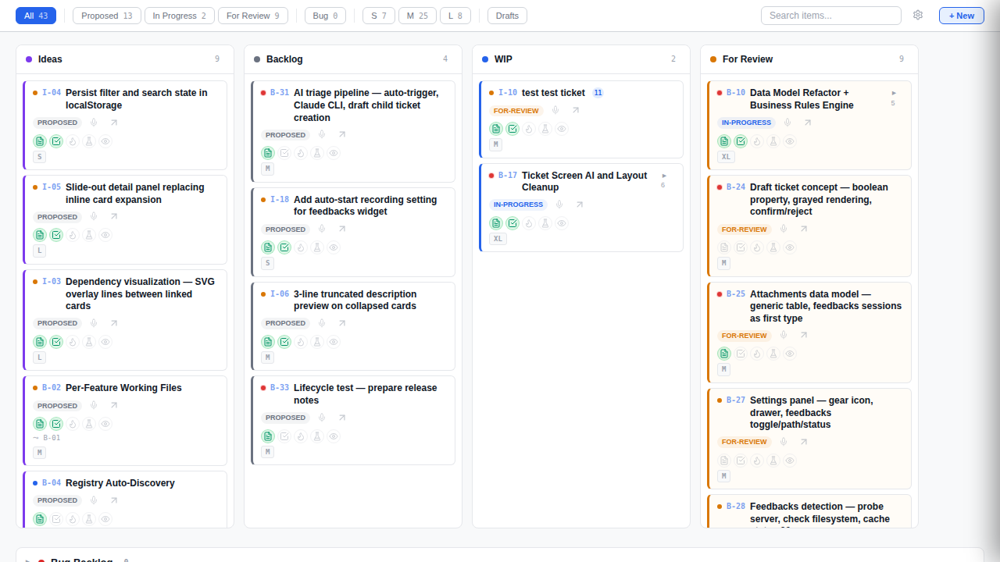
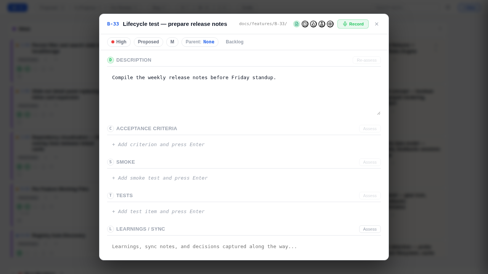
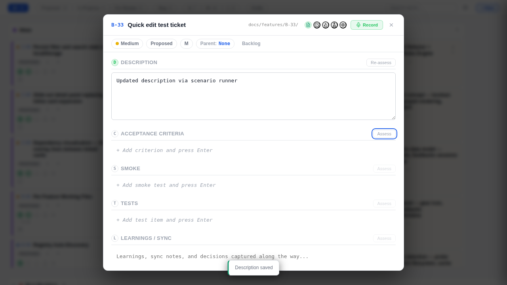

# Ticket Takeaway


```
                         _______________________________________________
                        /                                              /|
                       /  TICKET TAKEAWAY                             / |
                      /    ═══════════════                           /  |
                     /     ☐ grab  ☐ paste  ☐ build  ☐ ship        /   |
                    /_______________________________________________/    |
                    |                                               |    |       /spec
     ___            |  ┌───────┐ ┌───────┐ ┌───────┐ ┌───────┐     |    |      ───▶
    /   \    .--.   |  │ IDEAS │ │BACKLOG│ │  WIP  │ │REVIEW │     |    |      build
   | o o |  |    |  |  │ ░░░░  │ │ ░░░░░ │ │ ▓▓▓▓▓ │ │ ████  │     |  /      ───▶
    \ _ /   |    |  |  │ ░░    │ │ ░░░   │ │ ▓▓▓   │ │       │     | /      /review
     |||    '----'  |  └───────┘ └───────┘ └───────┘ └───────┘     |/      ───▶
    /   \           |_______________________________________________|      /accept
```

> SQLite-backed project board. Double-click. Paste. Build.

A lightweight process for people who work directly with their models to create software. Your kanban board is backed by SQLite and auto-generates markdown files.

Double-click a ticket on the dashboard to copy a prompt, paste it into Claude Code, the prompt will take into account the status and aim to do the next step to keep your feature flowing. Run as many windows as you want — the board is the coordination layer.

Agents can edit PRODUCT_BACKLOG.md directly — the CLI picks up changes via read-before-write sync. No data loss either way.


## Screenshots







## Install

### One-liner (from your project directory)

```bash
git clone https://github.com/ytubecoder/ticket-takeaway.git ~/ticket-takeaway && python3 ~/ticket-takeaway/install.py --register
```

This installs the CLI, generator, and skills, registers your project, and seeds the DB from your existing `PRODUCT_BACKLOG.md` (if you have one). You can clone to any directory you prefer — just replace `~/ticket-takeaway` with your chosen path.

### Or tell your agent

> Clone https://github.com/ytubecoder/ticket-takeaway to ~/ticket-takeaway and run `python3 ~/ticket-takeaway/install.py --register`. This will install the Ticket Takeaway dashboard system and register this project. If we have a PRODUCT_BACKLOG.md it will import existing tickets into the SQLite database automatically.

### Upgrade

```bash
cd ~/ticket-takeaway && git pull && python3 install.py
```

The installer copies the latest CLI, generator, and skills. The registry and DB are preserved — only system files are updated.

### After install

1. Run `/dashboard` to generate and open the board
2. Add tickets: `python3 ~/.claude/ticket-takeaway/tickets-cli.py add <project> "First feature"`
3. Or just add `### B-01: My Feature` to `PRODUCT_BACKLOG.md` — the CLI will pick it up

Full deployment map: [`INSTALL.md`](INSTALL.md)

## How a Ticket Progresses

```
  ┌──────────┐    ┌──────────┐    ┌──────────┐    ┌──────────┐    ┌──────────┐
  │  IDEAS   │───▶│ BACKLOG  │───▶│   WIP    │───▶│  REVIEW  │───▶│   DONE   │
  └──────────┘    └──────────┘    └──────────┘    └──────────┘    └──────────┘
     /spec           ready?        double-click      /review       /dashboard
   specifies       unblocked?      & build          verifies        accept
```

| Step | What happens | Gate |
|------|-------------|------|
| **1. Idea** | Add a ticket to `## Ideas`. Needs only an ID and title. | — |
| **2. Spec** | Run `/spec` — writes description + acceptance criteria. Moves to Backlog. | Description + at least one `- [ ]` criterion |
| **3. Ready** | Dependencies met, criteria are actionable. Status → `ready`. | Nothing blocking the start of work |
| **4. Build** | Double-click the card, paste into Claude Code. Ticket moves to `## WIP`. | Ticket is `ready` |
| **5. Complete** | All criteria addressed. Ticket moves to `## For Review`. | Implementation covers every criterion |
| **6. Review** | Run `/review` — walks through criteria, creates bug sub-tickets if needed. | All criteria verified |
| **7. Accept** | `/accept` moves ticket to `PRODUCT_SPECIFICATION.md`. | Review passed |

**Stage change** = `tickets-cli.py move <project> <id> <section>`. **State change** = `tickets-cli.py update <project> <id> --status <status>`. Or just edit the markdown — the CLI absorbs direct edits.

## Stages and States

The board uses a **stage-and-state** model from Kanban methodology. **Stages** are the columns (defined by `## Section` headings in your markdown). **States** are the `Status:` values on tickets — finer detail within a stage. Same column, different next actions. If you've used JIRA or GitHub Projects, it's the same concept: column = lane, status = position within it.

| Stage (Column) | States within it | Meaning |
|----------------|-----------------|---------|
| **Ideas** | `proposed` | Unvetted — just a title or rough notion |
| **Backlog** | `proposed`, `specified`, `ready` | Being specced and queued for work |
| **WIP** | `in-progress`, `blocked`, `rework` | Actively being built |
| **For Review** | `for-review` | Code complete, awaiting sign-off |
| **Done** | `done`, `released` | Accepted or shipped |

Side lanes: **Bugs** (`bug`, `bug-fixed`), **Icebox** (`icebox`), **Won't Do** (`wont-do`) — reachable from any stage.

## Skills

Skills are slash commands that guide your agent through specific workflow steps. They're assistive — you can always do things manually via the CLI or by editing markdown.

### `/dashboard`

Generates and opens the kanban board. The dashboard supports light, dark, and system themes, polls for live updates every 2 seconds, and works read-only via `file://` or fully interactive via the built-in server.

### `/spec` — Ideas to Backlog

Run `/spec` to walk through all ideas, or `/spec {ID}` for a specific one. The skill reads unvetted tickets, helps you write a description and acceptance criteria, sets priority and complexity, and moves the ticket to Backlog with status `specified`.

### `/review` — For Review to Done

Run `/review` to walk through completed work. The skill batches related tickets, verifies each acceptance criterion (using Chrome DevTools MCP tools to inspect the running app), creates `BUG-` sub-tickets from feedback, and manages the fix-and-verify loop until the parent can be accepted.

### `/accept` — Close a ticket

Moves a reviewed ticket to `PRODUCT_SPECIFICATION.md`, summarizes development notes, and cleans up working files.

### AI Readiness Assessment

Every ticket has five readiness flags — **D**escription, **C**riteria, **T**ests, **R**eview (learnings), **S**moke tests — shown as dots on the card and in the ticket detail overlay.

- **Gate-check on moves** — dragging a card between columns triggers an AI-powered readiness analysis. The gate panel shows a per-flag assessment with suggestions, and for Criteria, offers specific items you can add with one click.
- **Assess/Re-assess buttons** — in the ticket detail overlay, each readiness section has an Assess button that runs a focused AI analysis for just that category. Results include a summary, suggestion, and optionally generated content you can apply directly.
- **Content generation** — the AI can draft descriptions, criteria, test plans, and smoke test checklists. Generated content appears as a diff you can review and apply.

### `/feedbacks` — Visual feedback capture

Capture screen recordings with voice narration linked to specific tickets. Requires [Feedbacks](https://github.com/ytubecoder/feedbacks) to be installed (see below). The skill starts a capture session, links it to a ticket, and analyzes the recording to surface UI/UX issues.

## Feedbacks Integration

Ticket Takeaway integrates with [Feedbacks](https://github.com/ytubecoder/feedbacks) — a screen + voice capture tool for LLM-ready UI feedback. The integration is optional; ticket-takeaway works fully without it.


When installed, you can:

- **Record from the dashboard** — click the mic icon on any card or in the ticket detail overlay to open a capture popup linked to that ticket
- **Auto-link sessions** — a background watcher detects completed recordings and attaches them to the corresponding ticket automatically
- **Review with evidence** — `/review` checks for linked sessions and uses them as visual context during acceptance review
- **Manage in settings** — the dashboard settings drawer has a Feedbacks section for enable/disable, path configuration, and install

Sessions save to `{project}/.feedbacks/{ticket-id}/` and appear as attachments in the ticket detail overlay with a Play button to open the session player.

Install feedbacks separately:

```bash
git clone https://github.com/ytubecoder/feedbacks.git ~/projects/feedbacks
cd ~/projects/feedbacks && pip install mcp
```

Then enable it in the dashboard settings drawer (gear icon → Feedbacks Integration → Install).

**Compatible with:** [Claude Code](https://claude.ai/code) · [Codex CLI](https://github.com/openai/codex) · Any AI coding agent that reads markdown
